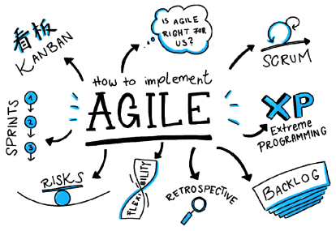
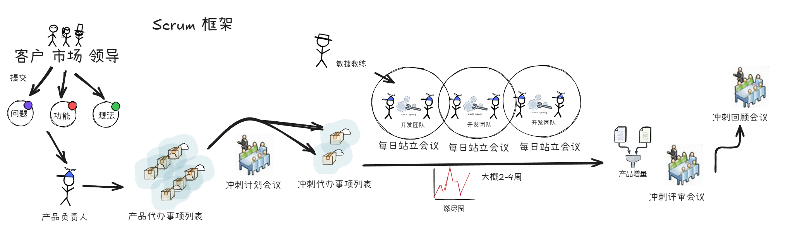
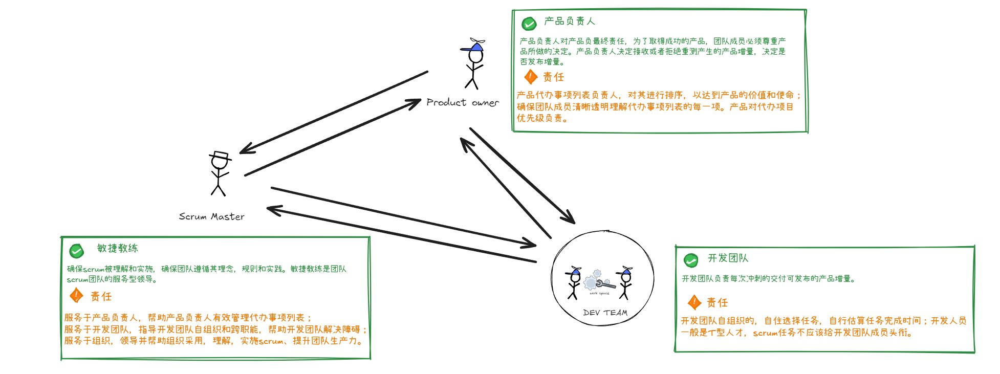
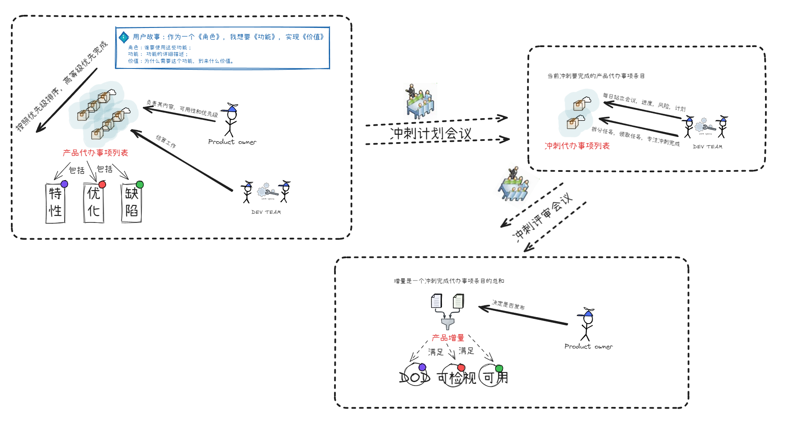
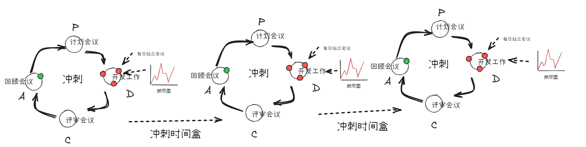
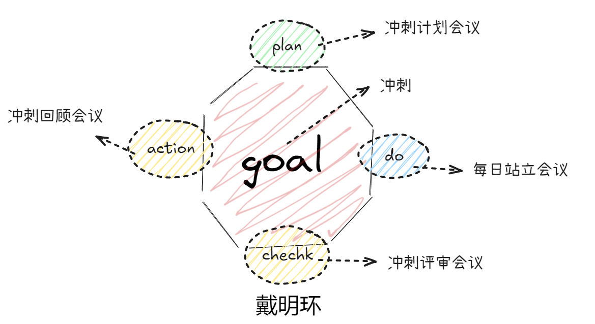
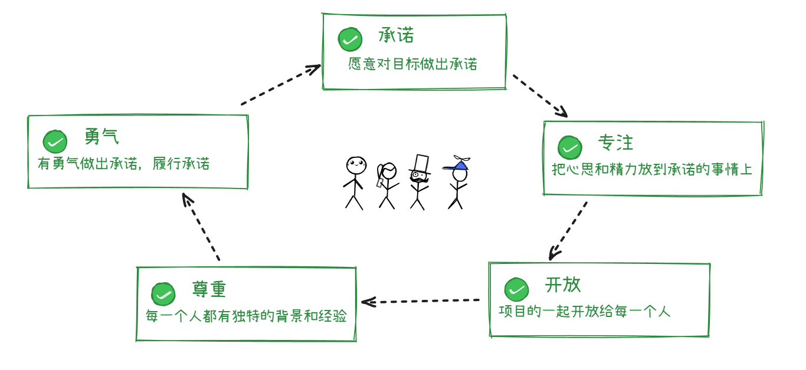
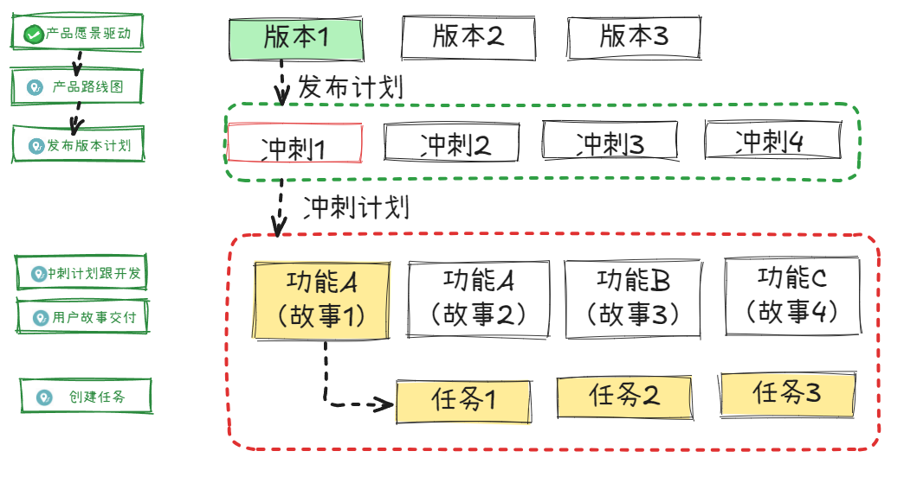

# 敏捷思想和实践：Scrum

## 背景与目标

敏捷（Agile）是一种在不确定环境中创造变化、响应变化的能力。  
本章目标是用一篇文章讲清楚：敏捷的价值观是什么，以及 Scrum 如何在团队中落地。

## 核心概念

### 四大价值观（Agile Manifesto）

敏捷并非否定流程、文档或计划，而是强调在冲突场景下的价值取舍：

1. 个体和互动高于流程和工具；
2. 可工作的软件高于面面俱到的文档；
3. 客户合作高于合同谈判；
4. 响应变化高于遵循计划。

> 右侧并非无价值，而是左侧在复杂变化环境中更优先。

### 十二项原则（精简版）

- 尽早并持续交付有价值的软件；
- 欢迎需求变化，即使在开发后期；
- 持续、频繁交付可用软件（倾向短周期）；
- 业务与研发每日协同；
- 围绕有动力的人构建团队，并给予支持与信任；
- 面对面沟通是高效的信息传递方式；
- 可工作的软件是首要进度指标；
- 保持可持续开发节奏；
- 持续关注技术卓越与设计质量；
- 追求简洁，减少不必要工作；
- 最佳架构与设计来源于自组织团队；
- 团队定期复盘并持续改进。

## 常见敏捷实践

- Scrum
- Kanban
- Extreme Programming（XP）

## Scrum 框架概览

Scrum 是一种增量式、迭代式的产品开发框架，适用于需求变化快、反馈频繁的场景。  
它通过短周期冲刺（Sprint）让团队持续交付可用增量。

## Scrum 核心：3-3-5-5

### 三个角色（3 Roles）

- **产品负责人（Product Owner, PO）**：对产品价值负责，管理产品待办列表（Product Backlog），并决定优先级；
- **Scrum Master**：保障 Scrum 被正确理解和执行，移除障碍，服务团队与组织；
- **开发团队（Developers）**：跨职能、自组织，负责在每个冲刺中交付可发布的增量。

### 三个工件（3 Artifacts）

- **产品待办列表（Product Backlog）**：按价值排序的需求池，是需求变更的唯一入口；
- **冲刺待办列表（Sprint Backlog）**：本次冲刺要完成的条目及实现计划；
- **产品增量（Increment）**：一个冲刺结束后满足完成定义（DoD）的可用成果。

### 五个事件（5 Events）

- **冲刺（Sprint）**：固定时长的开发周期，是 Scrum 的节奏核心；
- **冲刺计划会议（Sprint Planning）**：明确冲刺目标与本次要做的工作；
- **每日站会（Daily Scrum）**：15 分钟同步进展、计划与阻碍；
- **冲刺评审会议（Sprint Review）**：展示增量并收集干系人反馈；
- **冲刺回顾会议（Sprint Retrospective）**：复盘过程并形成改进动作。

Scrum 的事件流与 PDCA（Plan-Do-Check-Act）持续改进思想高度一致。通过周期性检视与调整，团队可不断提升交付效率与质量。

### 五个价值观（5 Values）

- **承诺（Commitment）**：对目标负责并兑现承诺；
- **专注（Focus）**：聚焦当下最重要的工作；
- **开放（Openness）**：信息透明，问题可见；
- **勇气（Courage）**：敢于面对问题并推动改变；
- **尊重（Respect）**：尊重每位成员的背景与专业判断。

## 发版规划（Release Planning）

发版规划通常从产品愿景出发，先形成路线图，再拆分为版本、冲刺和任务：  
**愿景 -> 路线图 -> 版本 -> 冲刺 -> 任务**。

## 常见误区

- 将 Scrum 误解为“只开会，不交付”；
- 冲刺期间频繁插入临时需求，破坏团队节奏；
- 把每日站会开成问题讨论会，导致超时低效；
- 只关注速度，不关注可用质量与 DoD。

## 小结

- 敏捷强调的是价值优先级，而非放弃流程；
- Scrum 用固定节奏建立“持续交付 + 持续改进”的机制；
- 角色、工件、事件和价值观共同构成可落地的团队协作系统。