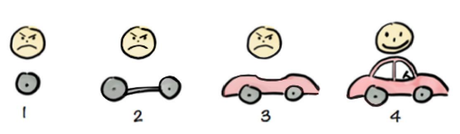
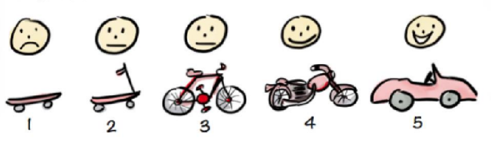

## 预测和敏捷

### 预测模式

预测模式按照传统项目管理方式进行软件研发。它用计划驱动，一开始收集所有需求，需求必须清楚明晰，编写成文档，按照文档从头到尾进行研发。
例如：客户期望制作一款运输产品，可以将物品从A点运到B点。
市场和产品团队觉得制作一辆轿车可以实现客户的目标。他们和客户对齐之后，做了完整的计划。此后，他们按照计划，从车轮、底盘，车身，发动机，从头到尾做了设计，记录文档，开发团队按照文档开发，测试，最后交付到客户手里。

这种模式存在的问题如下：

- 很多业务场景下，需求有边界但是无法完全清楚明晰；
- 市场变化节奏快，需求经常发生变化，无法快速响应；
- 客户无法高频率参与，他们认为需求在前期已经明确清晰；
- 需要大量的时间来汇报项目状态；
- 价值只有在开发结束的那一刻才可以体现出来。
那么敏捷是如何解决这些问题，并且保证传统项目中的10大知识领域的管理呢？

### 敏捷模式

还是使用上面的例子。
客户期望制作一款运输产品，可以将物品从A点运到B点。
敏捷团队考虑如何最小可行产品到达这个目标。最开始市场和产品负责人觉得滑板（四个轮子加一块板子）就可以实现客户的目标。于是他们做了最小的发行版本交付到客户，等待客户的反馈。根据客户的反馈从再进行下一步的迭代。至于最终的产品形态如何完全取决于客户和市场的反馈。他可能是一辆自行车，可以能是一辆摩托车，也有可能是一辆小轿车。
从这个例子来说，如果团队使用预测模式开发产品到后期，客户或者市场发生变化，导致需求变化，如果这时候调整产品研发，成本将非常大。而敏捷模式可以避免这个问题，因为敏捷模式始终以最小可行产品投入市场获取反馈。
敏捷是一种创造变化和响应变化，在不确定和混乱的环境中取得胜利的能力。

### MVP版本

MVP，最小可行版本。研发团队使用最小的成本和最短的时间实现满足客户需求的可用版本，此后在这个最小版本上快速迭代，直到产品到达相对稳定的阶段。它对创业团队非常重要，可以快速验证团队的目标，快速试错，快速调整。

### 使用场景

- 需求不确定性高的项目；当项目初期需求不明确或可能频繁变更时（如创新产品或市场快速变化的领域），敏捷通过短周期迭代（如1-4周的Sprint）和持续客户反馈，快速调整方向，避免传统瀑布等预测模型因需求变更导致的资源浪费。
- 当项目初期需求不明确或可能频繁变更时（如创新产品或市场快速变化的领域），敏捷通过短周期迭代（如1-4周的Sprint）和持续客户反馈，快速调整方向，避免传统瀑布模型因需求变更导致的资源浪费。
- 客户深度参与的项目‌：客户或利益相关者能定期评审迭代成果并提供反馈的场景（如定制化软件开发），确保产品始终符合实际需求。‌‌
- 高度协作的团队环境‌：跨职能团队（开发、测试、产品经理等）需每日同步进度（如站会）且成员具备自主决策权时，敏捷能最大化协作效率。‌‌
- 频繁迭代的产品领域‌：如移动应用、Web开发或游戏行业，需持续发布新功能以响应用户反馈，敏捷的增量开发模式可高效支持。‌‌

